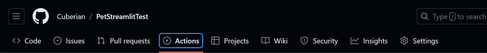
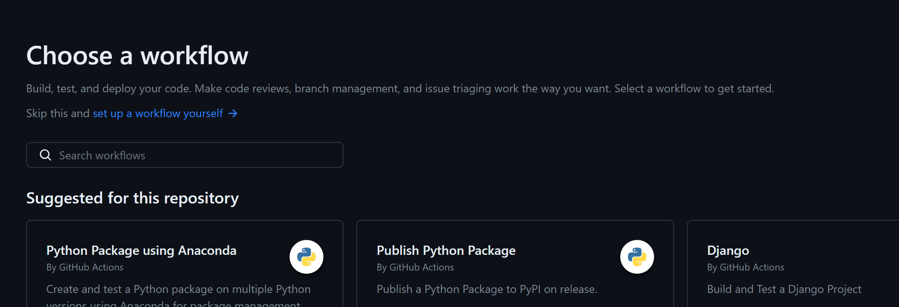
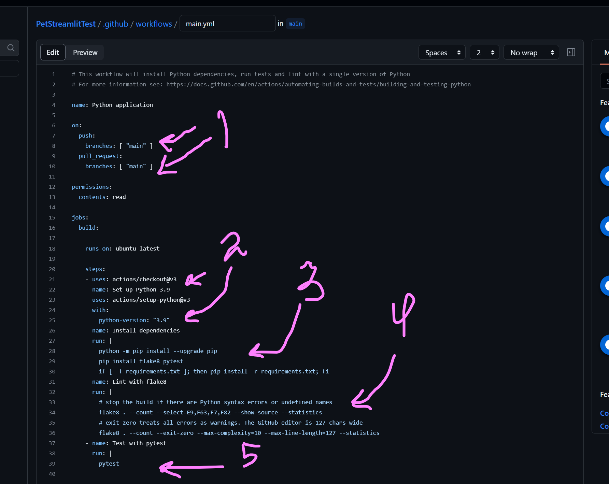

# PetStreamlitTest
## Установка Streamlit в проекте
1) Открыть проект в PyCharm и установить интерпритатор в проект
2) Открыть терминал и ввести команду ```pip install streamlit```
3) Создать в корне проекта файл, в котором будет описан интерфейс приложения (в данном проекте ```streamlit_app.py```)
## Разворачивание Streamlit приложения
1) Необходимо авторизоваться на платформе Streamlit (лучше всего с аккаунта на гитхабе) для того, чтобы связать с репозиторием
2) При необходимости, создайте Workspace
3) Нажмите на синюю кнопку New App, после чего в открывшемся окне заполните форму:
   - В первом пункте выберете необходимый репозиторий для деплоя из выпадающего списка или вставьте ссылку на него
   - Во втором пункте выберете ветку, изменения в которой будут автоматически синхронизироваться с платформой Streamlit и вызывать обновление сборки
   - В третьем пункте (main file path) укажите путь до файла, в котором написан код интерфейса приложения. Для удобства файл с интерфейсом рекомендуется размещать в корне проекта
   - В поле ссылки уже автоматически формируется текст, можно оставить дефолтный, главное чтобы небыло streamlit в названии.
4) Нажать кнопку deploy после чего приложение будет собрано и будет пересобираться каждый раз после обновления в ветке. Также сайт можно пересзапустить, нажав кнопку бургер в верхнем правом углу и выбрав пункт Rerun.

_**Пример приложения представлен в файле ```streamlit_app.py```**_

_**Ссылка на компоненты для использования приложения: [https://docs.streamlit.io/library/api-reference](https://docs.streamlit.io/library/api-reference)**_

## Создание Workflow на проверку flake8 и pytest
1) Заходим в репозиторий на github и открываем вкладку **Actions**

2) Чуть ниже в левой части нажимаем **New workflow**

3) Нажимаем на ссылку **Set up a workflow yourself**

4) В открывшееся окно вставляем текст из файла `.github/workflows/main.yml`. 
Там необходимо:
   - 1 - Указать свою ветку для проверки.
   - 2 - Указать свою весию питона.
   - 3 - Здесь прописаны команды для установки библиотек flake8 и pytest а также команда для установки библиотек из файла requirements.
   - 4 - Здесь прописаны команды для запуска проверки всех файлов с помощью flake8. Через -- указаны на какие правила нужно проверить файлы.
   - 5 - Здесь прописана команда на запуск pytest. тестами будут считатся любые функции начинающиеся с test_ в названии и сравнением через assert внутри. Примеры тестов представлены в файле `tests.py`

5) После редактирования текста жмем зеленую кнопку Commit changes в верхнем левом углу и теперь все будет прогонятся каждый раз при пуше в указанную ветку а результат action будет представлен на вкладке **Actions**
