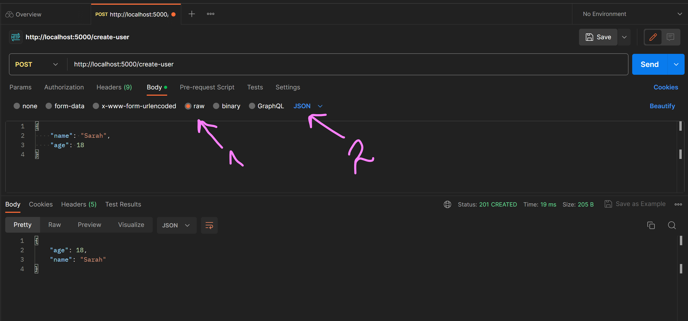

# PetStreamlitTest
## Установка Streamlit в проекте
1) Открыть проект в PyCharm и установить интерпритатор в проект
2) Открыть терминал и ввести команду ```pip install streamlit```
3) Создать в корне проекта файл, в котором будет описан интерфейс приложения (в данном проекте ```streamlit_app.py```)
## Разворачивание Streamlit приложения
1) Необходимо авторизоваться на платформе Streamlit (лучше всего с аккаунта на гитхабе) для того, чтобы связать с репозиторием
2) При необходимости, создайте Workspace
3) Нажмите на синюю кнопку New App, после чего в открывшемся окне заполните форму:
   - В первом пункте выберете необходимый репозиторий для деплоя из выпадающего списка или вставьте ссылку на него
   - Во втором пункте выберете ветку, изменения в которой будут автоматически синхронизироваться с платформой Streamlit и вызывать обновление сборки
   - В третьем пункте (main file path) укажите путь до файла, в котором написан код интерфейса приложения. Для удобства файл с интерфейсом рекомендуется размещать в корне проекта
   - В поле ссылки уже автоматически формируется текст, можно оставить дефолтный, главное чтобы небыло streamlit в названии.
4) Нажать кнопку deploy после чего приложение будет собрано и будет пересобираться каждый раз после обновления в ветке. Также сайт можно пересзапустить, нажав кнопку бургер в верхнем правом углу и выбрав пункт Rerun.

_**Пример приложения представлен в файле ```streamlit_app.py```**_

_**Ссылка на компоненты для использования приложения: [https://docs.streamlit.io/library/api-reference](https://docs.streamlit.io/library/api-reference)**_

## Создание Workflow на проверку flake8 и pytest
1) Заходим в репозиторий на github и открываем вкладку **Actions**

2) Чуть ниже в левой части нажимаем **New workflow**

3) Нажимаем на ссылку **Set up a workflow yourself**

4) В открывшееся окно вставляем текст из файла `.github/workflows/main.yml`. 
Там необходимо:
   - 1 - Указать свою ветку для проверки.
   - 2 - Указать свою весию питона.
   - 3 - Здесь прописаны команды для установки библиотек flake8 и pytest а также команда для установки библиотек из файла requirements.
   - 4 - Здесь прописаны команды для запуска проверки всех файлов с помощью flake8. Через -- указаны на какие правила нужно проверить файлы.
   - 5 - Здесь прописана команда на запуск pytest. Рекомендуется либо назвать файл с тестами `run_test.py` либо прописать после pytest(5) путь до файла с тестами. Примеры тестов представлены в файле `tests.py`

5) После редактирования текста жмем зеленую кнопку Commit changes в верхнем левом углу и теперь все будет прогонятся каждый раз при пуше в указанную ветку а результат action будет представлен на вкладке **Actions**


##Создание и разворачивание API
1) Установим flask при помощи команды `pip install flask`.
2) Составим пример API в файле `api.py`. 
Апи обязательно должно быть описано в функции create_app для дальнейшего удобного тестирования. 
Для запуска апи достатоно вызвать команду в терминале `python api.py`.
3) для проверки пост запроса можно использовать постман. 
Для осуществления запросов он может предложить **_установить Postman Agent - это необходимо сделать для корректной работы_**.
Пример вызова по роуту 'get-user'(чтобы открыть такое же меню, нужно перейти на вкладку Body, нажать raw (1) и выбрать JSON(2)):


##Тестирование API
1) В начале необходимо установить библиотеку pytest при помощи команды `pip install pytest`
2) После необходимо создать файл с тестами по примеру файла `api_tests.py`
3) Запуск тестов можно осуществить в терминале командой `pytest api_tests.py`
